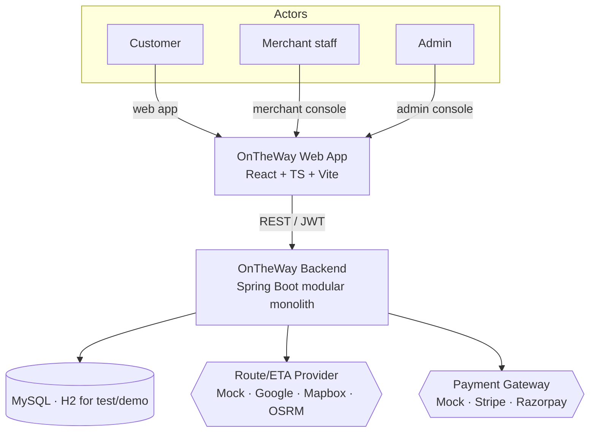
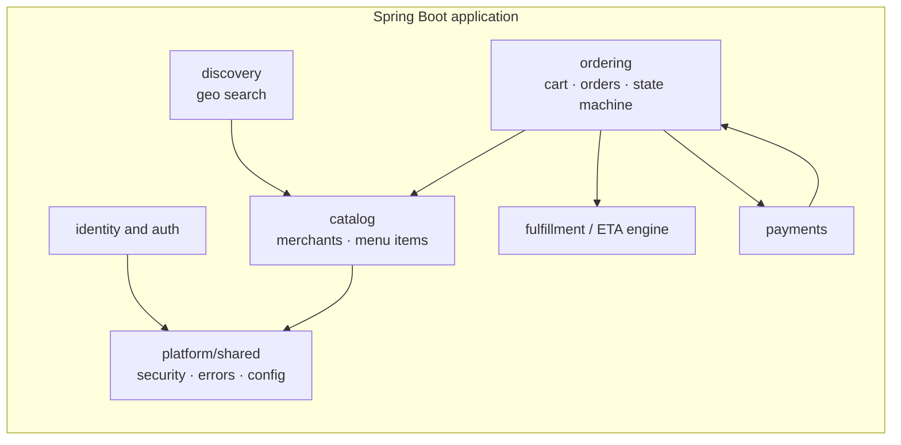
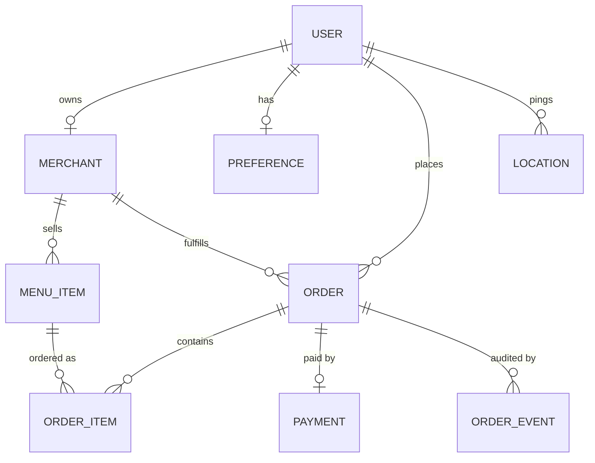
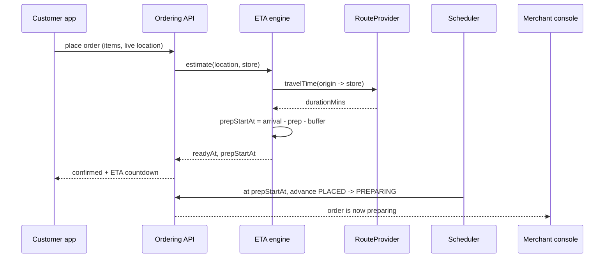
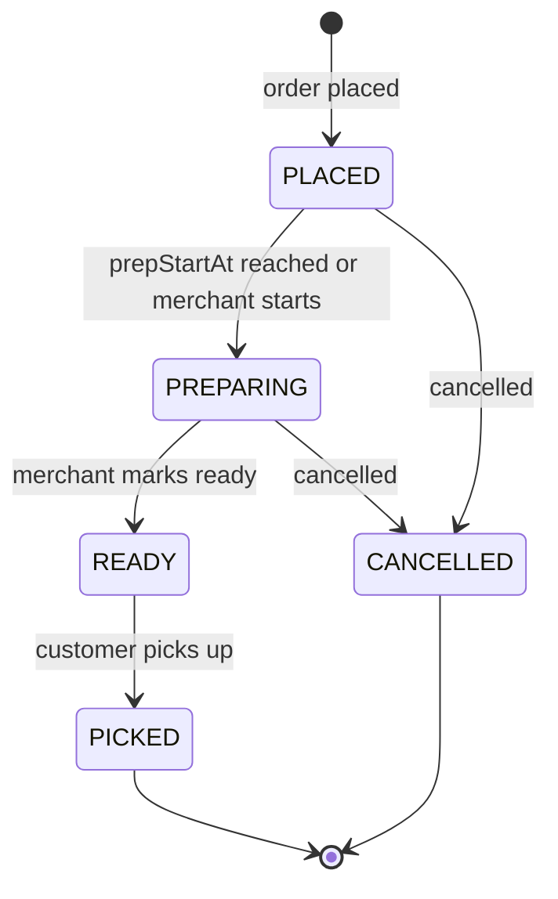
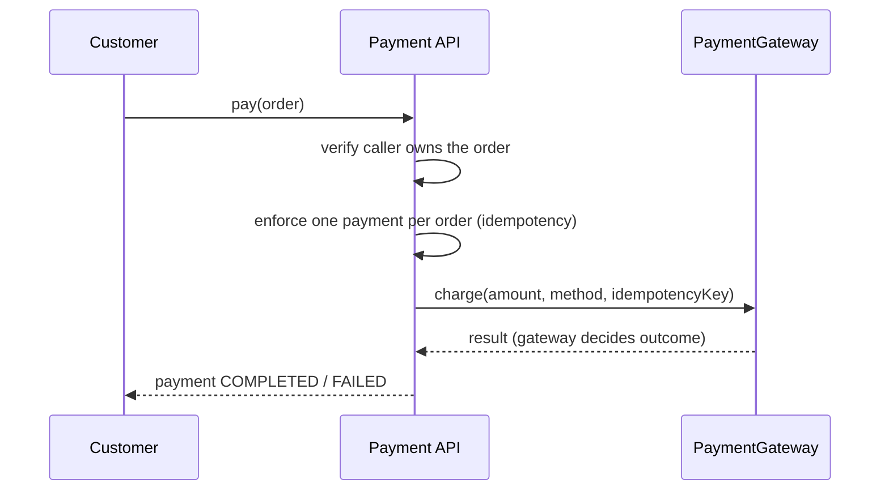
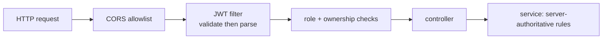
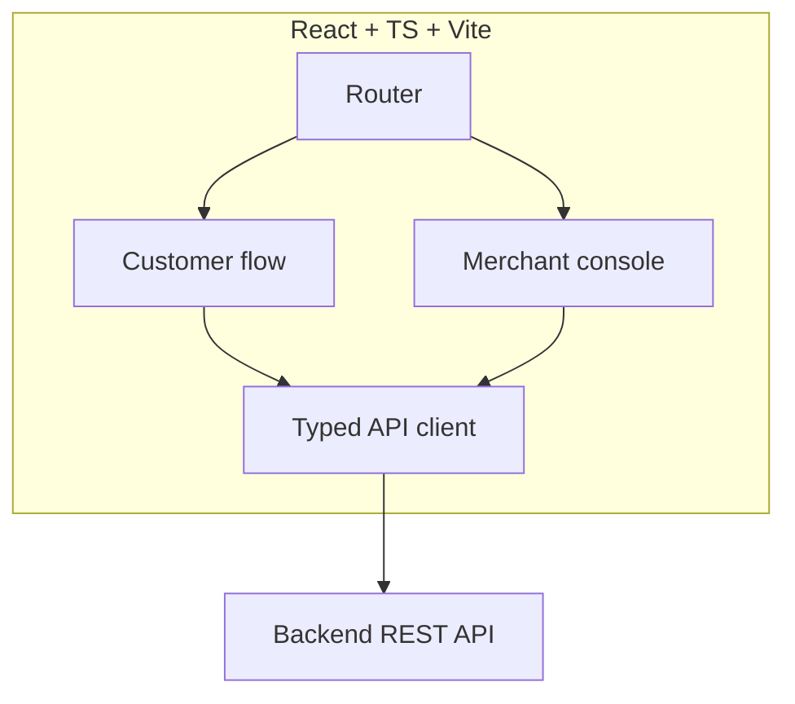
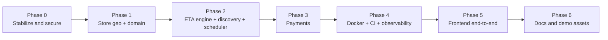

# OnTheWay — System Architecture

> **Status:** v1.0 · **Owner:** Manohar Eldhandi
> This document describes the system design and the rationale behind the main decisions.
> The ordered, implementable work breakdown derived from it lives in [to-do.md](to-do.md).

---

## 1. Product vision

**OnTheWay** removes waiting. You pre-order from any nearby shop while you are *on the way*,
and the order is **ready exactly when you arrive** — synchronized to your live ETA. Walk in,
pick up, go. No queue, no idle wait, nothing prepared too early.

It is **not** food-only. The same primitive — *pre-order + ETA-synced pickup* — serves
restaurants, pharmacies, grocery, retail, cafés, and many more verticals.

### What must be excellent
The **ETA-synchronization engine** is the differentiator: *the store starts preparing at the
right moment so the order is fresh and ready the second the customer reaches the door.*
Everything else (catalog, cart, payments, auth) is necessary table stakes. The engineering
investment is concentrated on the differentiator; everything else uses proven, conventional
technology.

---

## 2. Architecture principles

1. **Modular monolith first.** One deployable Spring Boot application with strict internal
   module boundaries. The system is not prematurely split into microservices.
2. **Provider abstractions for external services.** Routing and payments sit behind interfaces
   with a mock implementation, so the entire product runs and is tested with zero external API
   keys; real providers are selected by configuration.
3. **Server-authoritative.** Prices, totals, ETAs, order status, and payment status are decided
   by the server and never trusted from the client.
4. **Secure by default.** Least-privilege roles, ownership checks on every resource, secrets
   kept out of source control, validated inputs.
5. **Testable and migratable.** Versioned database migrations and unit, slice, and integration
   tests; reproducible builds and containers.
6. **Extensible domain.** The model expresses the generic "a store sells catalog items for ETA
   pickup", so adding a vertical is configuration and data rather than a rewrite.

---

## 3. System context (C4 — Level 1)

## 4. Module view (C4 — Level 2)

Modules communicate through service interfaces rather than reaching into each other's
repositories. Package structure enforces these boundaries.

---

## 5. Domain model

The store carries geo coordinates and a preparation time, which the ETA engine and discovery
both use. Each order records an immutable `ORDER_EVENT` for every status transition. `StoreType`
is an extensible category enumeration that already spans several verticals.

**Planned domain extensions** (documented, not yet built): a dedicated `Store` entity to allow
one merchant to operate multiple locations, a generalized `Product` concept with
vertical-specific attributes, monetary values stored as minor units with an explicit currency,
and a prescription attachment + review flow for the pharmacy vertical.

---

## 6. The differentiator: ETA-synchronization engine

### Responsibilities
- Estimate travel time from the customer's live location to the store.
- Use the store's preparation time and a safety buffer.
- Compute the prep-start moment: `prepStartAt = arrival − prepTime − safetyBuffer`.
- Persist `prepStartAt` and `readyAt`, and advance the order automatically at the right time.

### Design

- **`RouteProvider` interface**:
  - `HaversineRouteProvider` — great-circle distance ÷ a configurable average speed; keyless and
    deterministic, used by default and in tests.
  - `GoogleRouteProvider` / `MapboxRouteProvider` / `OsrmRouteProvider` — traffic-aware routing,
    selected by configuration. *(Planned; the interface and the mock are in place.)*
- **Scheduler**: a scheduled scan moves orders to `PREPARING` at `prepStartAt` and records an
  audit event. The core scan accepts an injected clock for deterministic testing.

The synchronization algorithm is independent of the routing provider, so the mock and a real
provider produce the same behaviour with different distance inputs.

---

## 7. Order lifecycle (state machine)

- Transitions are guarded by a central validator; an illegal transition returns `400`, never `500`.
- Every transition writes an `ORDER_EVENT` (actor, from, to, reason, timestamp).
- Place-order validation is server-authoritative: each item must belong to the target store and
  be available, quantities must be positive, and prices come from the catalog.

---

## 8. Payments

- **`PaymentGateway` interface**: `MockPaymentGateway` (keyless, deterministic) is the default.
  Stripe and Razorpay implementations are selected by configuration. *(Planned; the interface and
  the mock are in place.)*
- The gateway decides the outcome; the client can never set payment status, and the amount comes
  from the order total.
- One payment per order is enforced; a repeat attempt returns `409`.

**Planned**: a webhook endpoint with signature verification for asynchronous confirmation, and
refunds wired to order cancellation.

---

## 9. Discovery

- `GET /api/discovery/nearby` returns located stores within a radius of a point, annotated with
  distance and travel time, ordered nearest-first, optionally filtered by category.
- The current implementation filters candidate stores in memory, which is appropriate for the
  expected dataset. It can be replaced by a bounding-box or spatial-index query behind the same
  service interface.

**Planned**: open-now filtering, product/text search, and on-route corridor discovery.

---

## 10. Security architecture

- **Authentication**: stateless JWT; the filter validates signature and expiry before reading
  any claim, and authentication failures return `401`, never `500`.
- **Authorization**: role rules (`USER` / `MERCHANT` / `ADMIN`) combined with per-resource
  ownership checks, enforced both at the URL level and with method-level annotations.
- **Registration**: the role is never taken from the client; it defaults to `USER`, and `ADMIN`
  cannot be self-registered.
- **Secrets**: read from environment variables; `.env.example` is committed, real values are not.
- **Transport**: a CORS allowlist (no wildcard) and baseline security response headers.

**Planned**: refresh tokens with rotation and revocation, and authentication rate limiting.

---

## 11. Cross-cutting concerns

| Concern | Decision |
|---|---|
| **Migrations** | Flyway versioned SQL; Hibernate `ddl-auto=none` (Flyway is the single source of truth). |
| **Configuration** | Spring profiles `dev` / `test` / `prod` / `demo`; all secrets externalized. |
| **Observability** | Spring Boot Actuator health, info, and metrics endpoints. |
| **Testing** | JUnit 5 + Mockito (unit), MockMvc (slice/integration), H2 running the real migrations (hermetic), plus a load/stress test. |
| **Packaging** | Multi-stage Dockerfile and docker-compose (application + MySQL). |
| **CI** | GitHub Actions: backend build and test, frontend type-check and build. |

**Planned**: API versioning under `/api/v1`, pagination and sorting on list endpoints, MapStruct
mappers, and structured logs with a correlation id.

---

## 12. Frontend architecture

- **React + TypeScript + Vite**, React Router, a small typed API client, and a context-based auth
  and cart layer.
- **Three experiences** behind one application: the customer flow (discover → cart → checkout →
  live ETA → tracking) and a merchant console; an admin console is planned.
- **Keyless SVG map**: store and customer positions are projected onto an SVG canvas, so the map
  needs no tiles and no API key and works offline. A tiled map library can replace the component
  without changing the pages.
- **Live updates** use short-interval polling today; a real-time channel can replace polling
  without a UI redesign.
- The client talks only to the REST API and contains no business logic.

---

## 13. Key technical decisions

| # | Decision | Rationale | Status |
|---|---|---|---|
| ADR-1 | Modular monolith, not microservices | Right-sized for the scope; clean boundaries; fast to run and demo | Adopted |
| ADR-2 | Java + Spring Boot backend | Mature ecosystem; strong fit for the domain | Adopted |
| ADR-3 | Provider abstractions with mock defaults | Keyless, reproducible runs; real providers swap in via config | Adopted |
| ADR-4 | Flyway with `ddl-auto=none` | Deterministic schema; no silent drift | Adopted |
| ADR-5 | Extensible `StoreType` category enum | Supports multiple verticals without a rewrite | Adopted |
| ADR-6 | React + TS + Vite frontend | End-to-end demoable; modern, widely used stack | Adopted |
| ADR-7 | Keyless SVG map | Reliable demo with no external dependency | Adopted |
| ADR-8 | Defer multi-store, real-time, ML ranking, native mobile | Avoid speculative complexity until needed | Deferred (documented) |

---

## 14. Phased roadmap

| Phase | Scope | State |
|---|---|---|
| 0 | Security and correctness fixes, Flyway, test harness | Delivered |
| 1 | Store geo and preparation time | Delivered |
| 2 | ETA engine, route provider, discovery, auto-advance scheduler | Delivered |
| 3 | Payment gateway abstraction and mock provider | Delivered |
| 4 | Docker, compose, CI, Actuator | Delivered |
| 5 | React frontend (customer + merchant) | Delivered |
| 6 | Documentation and demo assets | Delivered |

Remaining enhancements (real-time channel, on-route discovery, real payment providers and
webhooks, refresh tokens, admin console, monetary minor units, API versioning) are tracked in
[to-do.md](to-do.md). They are deliberately deferred and are not required for the product to run
end-to-end.
