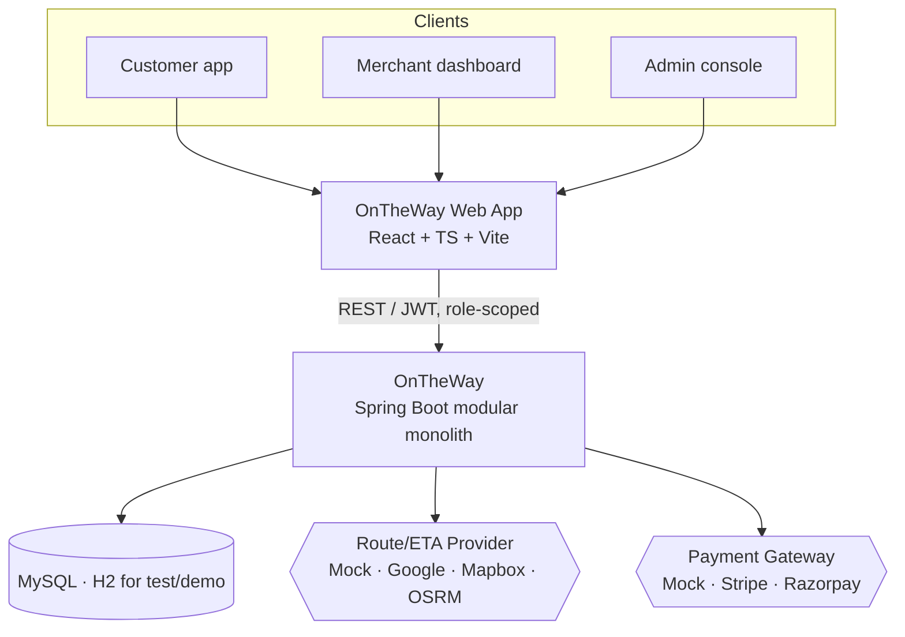
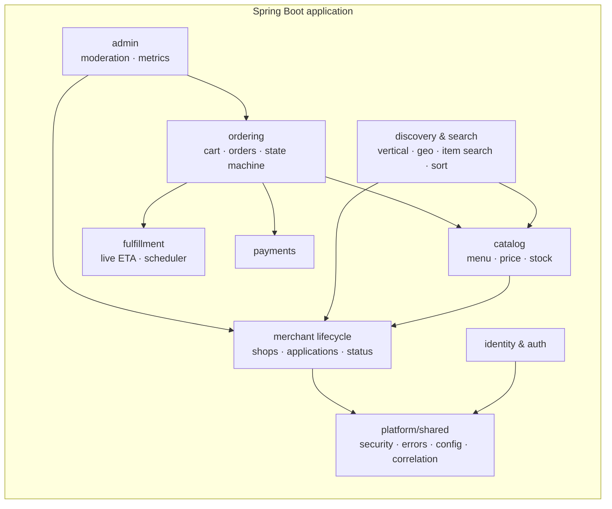
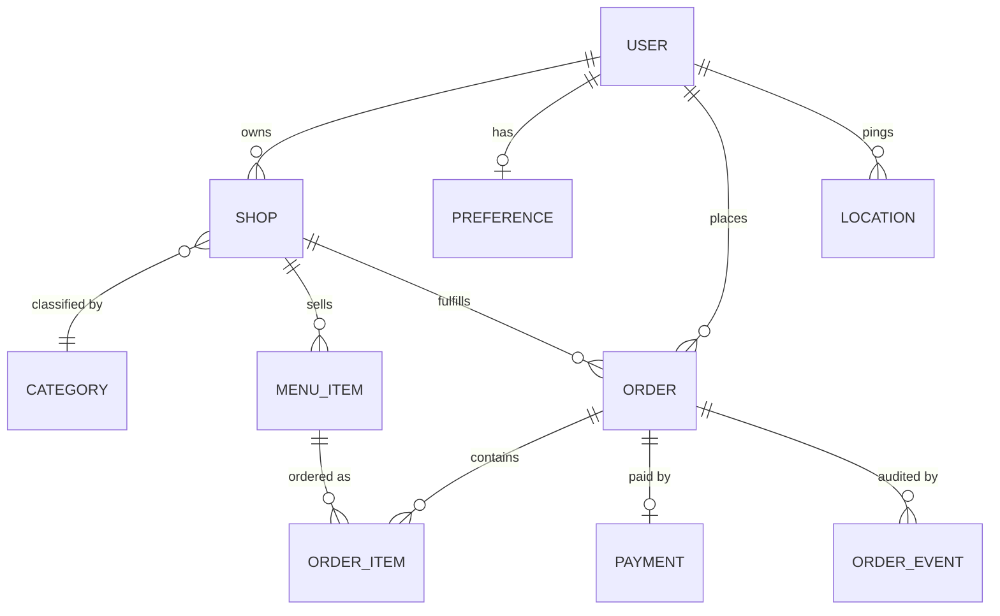
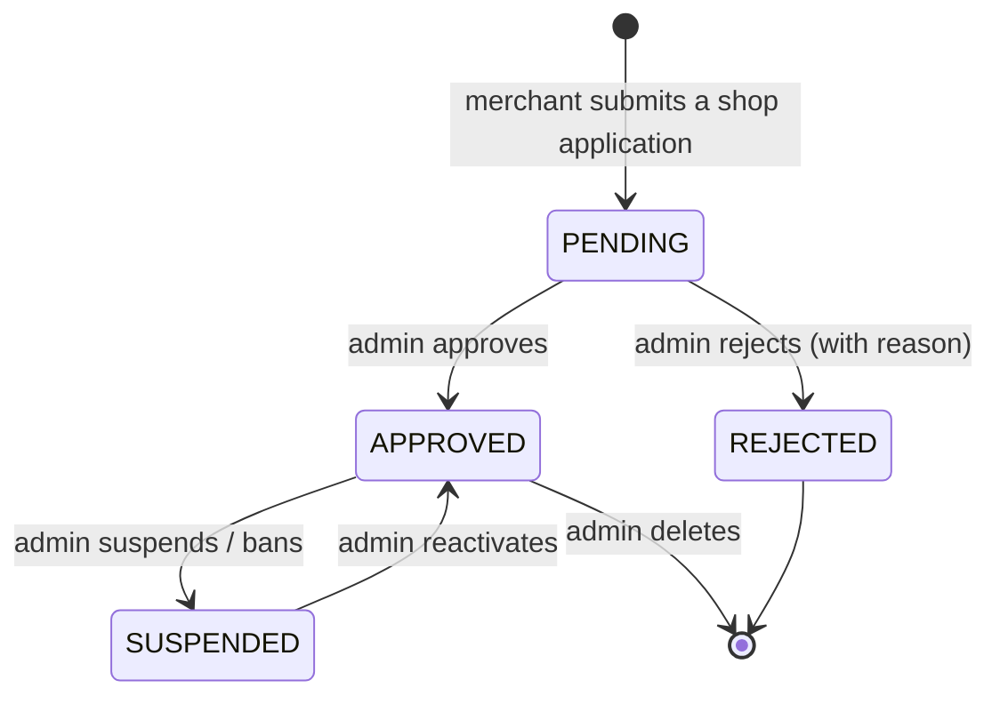
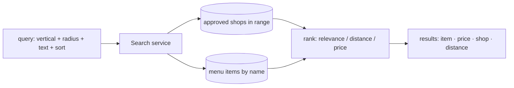
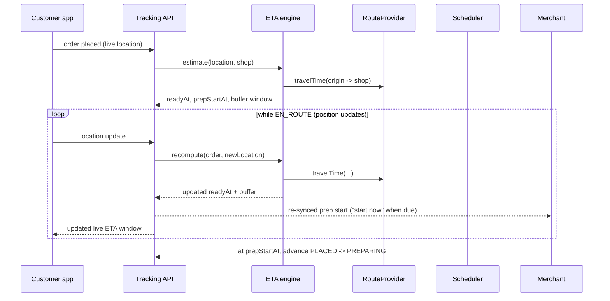
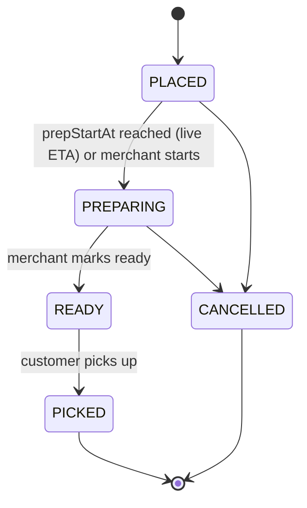
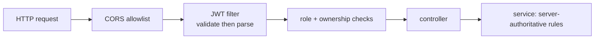
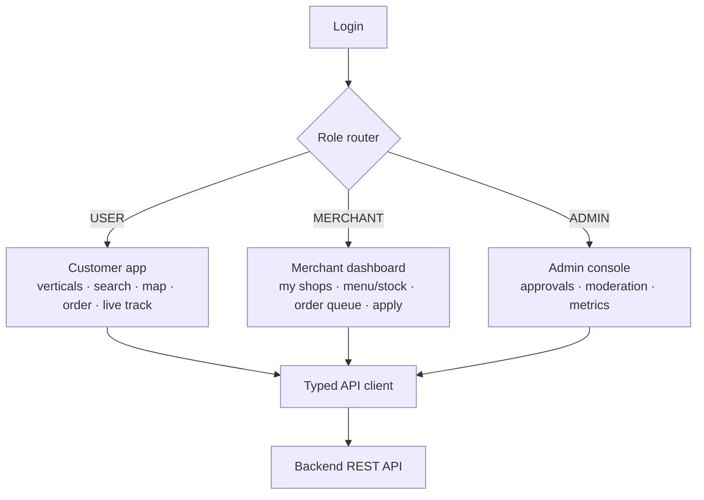
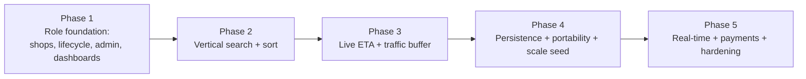

# OnTheWay — System Architecture

> **Status:** v2.0 (product) · **Owner:** Manohar Eldhandi
> This document describes the architecture of OnTheWay as a multi-role product: a platform where
> customers order from nearby shops while travelling and pick up on arrival, merchants run their
> shops, and administrators operate the marketplace. The implementable breakdown lives in
> [to-do.md](to-do.md).

---

## 1. Product vision

**OnTheWay** lets you order while you travel and pick up on arrival, with no waiting. As you move,
you see shops around you — restaurants, pharmacies, grocery, hotels, and many more — within the
range and category you choose. You order from a shop's menu, and the shop times preparation to
your **live ETA** so the order is ready exactly when you reach the door.

The platform is **not** food-only and **not** a single app. It is a marketplace with three first-
class roles:

- **Customer** — discovers shops on a map by category and search, orders, and tracks a live ETA.
- **Merchant** — applies to open one or more shops, manages menus and stock, and fulfils orders.
- **Administrator** — approves or rejects shop applications, moderates merchants, and monitors
  the platform.

The name *OnTheWay* is the product: ordering happens **on the way**, and the ETA is **live**,
driven by the customer's movement and adjusted for traffic — comparable in spirit to the live
ETAs in navigation and ride-hailing apps.

---

## 2. Architecture principles

1. **Role-separated product.** Each role has its own dashboard, controls, and authorization.
   The same backend serves all three through clearly scoped APIs.
2. **Marketplace lifecycle.** Shops have a lifecycle (application → approval → live → suspended).
   Only approved, active shops are publicly discoverable.
3. **Modular monolith.** One deployable Spring Boot application with strict internal module
   boundaries; not prematurely split into microservices.
4. **Provider abstractions.** Routing and payments sit behind interfaces with keyless mock
   implementations, so the product runs and is tested with no external keys; real providers are
   selected by configuration.
5. **Server-authoritative.** Prices, totals, ETAs, order status, payment status, and shop
   visibility are decided by the server, never trusted from the client.
6. **Durable and portable.** MySQL is the durable store; the whole stack runs with one command
   (Docker compose) so it can be developed on one machine and run on another.
7. **Live by design.** ETA is continuous: customer location updates recompute the ready time and
   re-sync the merchant, with a traffic-aware buffer rather than a single brittle number.

---

## 3. Roles and capabilities

| Capability | Customer | Merchant | Admin |
|---|:---:|:---:|:---:|
| Browse/search shops & items | ✓ | | ✓ |
| Place orders, live tracking | ✓ | | |
| Apply to open a shop | | ✓ | |
| Operate **multiple** shops | | ✓ | |
| Manage menu / price / stock | | ✓ (own) | |
| Fulfil orders (status) | | ✓ (own) | |
| Approve / reject applications | | | ✓ |
| Suspend / ban / delete shops | | | ✓ |
| Platform metrics & directory | | | ✓ |

---

## 4. System context (C4 — Level 1)

## 5. Module view (C4 — Level 2)

---

## 6. Domain model

Evolution from the current model:

- **A user can own many shops.** The previous one-shop-per-user relationship becomes
  one-owner-to-many-shops. (The existing `Merchant` entity is treated as a *shop* owned by a user;
  the term "shop" is used in the product and APIs.)
- **Shop status** (`PENDING`, `APPROVED`, `REJECTED`, `SUSPENDED`) governs discoverability and is
  controlled by the admin. New shops start `PENDING`.
- **Category** is an extensible vertical taxonomy (restaurant, pharmacy, grocery, hotel, …) so the
  platform spans many fields without a rewrite.
- **Menu item** carries price and an availability/stock flag the merchant controls.
- **Order** carries the live ETA fields: travel estimate, ready-at, prep-start-at, and a buffer.

---

## 7. Merchant lifecycle

- A shop is **publicly discoverable only when `APPROVED` and not suspended**.
- A merchant can manage a shop's menu while it is `PENDING` (so it is ready when approved), but it
  will not appear in discovery or accept orders until approved.
- All admin moderation actions are authorized to the `ADMIN` role and recorded.

---

## 8. Discovery, vertical selection & search

The customer first chooses a **vertical** (or "all"), a **range**, and may type a **search query**.

- **Vertical selection**: results are limited to the chosen category (or all categories).
- **Powerful search**: the query matches **both shop names and item names**. An item result
  carries its price, its shop, and the distance to that shop.
- **Sorting**: by **distance**, **price**, or **relevance**.
- **Range**: only shops within the chosen radius (and only approved, active shops) are returned.
- The current implementation evaluates candidates in memory, which suits the demo dataset; it can
  be replaced by a spatial/bounding-box query and a search index behind the same service
  interface without changing callers.

---

## 9. Live ETA (the differentiator)

ETA is **continuous**, not a single value computed once.

- **Continuous recompute**: each customer location update recomputes travel time and the order's
  ready time, and re-syncs the merchant's prep start.
- **Traffic-aware buffer**: the engine returns an **ETA window** (`earliest`–`latest`) using a
  configurable buffer that widens with distance and modelled traffic, rather than a single number
  that is wrong the moment traffic changes. The buffer is configurable per deployment and per shop.
- **`RouteProvider`**: the keyless Haversine provider is the default; traffic-aware providers
  (Google, Mapbox, OSRM) plug in by configuration and feed real durations into the same engine.
- The engine is clock-injected for deterministic testing.

---

## 10. Order lifecycle

Transitions are guarded; illegal transitions return `400`. Every transition writes an
`order_events` audit row. Place-order validation is server-authoritative.

---

## 11. Security & authorization

- Stateless JWT; signature/expiry validated before claims are read; auth failures return `401`.
- **Role-scoped APIs**: `/api/admin/**` (admin), `/api/merchant/**` (merchant, own resources),
  customer and discovery APIs (authenticated users). Method-level checks plus ownership checks.
- Registration cannot self-assign `ADMIN`; merchant capability is granted by role, but operating a
  live shop requires admin approval.
- Secrets are read from the environment; CORS is an allowlist; security headers are set.

---

## 12. Persistence & portability

| Concern | Decision |
|---|---|
| Durable store | **MySQL** for `dev`/`prod`; passwords (BCrypt) and all data persisted. |
| Test/demo store | **H2** running the real Flyway migrations (hermetic, zero setup). |
| Schema | **Flyway** versioned migrations; `ddl-auto=none`. |
| Portability | **Docker compose** brings up MySQL + backend with one command, so the project can be developed on one machine and run on another without manual database setup. |
| Configuration | Spring profiles; every secret and host is an environment variable with a safe local default. |

---

## 13. Frontend architecture (role-separated)

- **React + TypeScript + Vite**, React Router, a typed API client, and context-based auth/cart.
- **Role-aware routing**: after login the app lands on the dashboard for the user's role and
  guards routes so a role cannot reach another role's screens.
- **Customer**: vertical picker + search bar (shops *and* items) with sort, map discovery, store
  menu, cart, ETA checkout, and live order tracking.
- **Merchant**: a list of the merchant's shops with status, menu management (add/edit/price/stock),
  an order queue, and a new-shop application form.
- **Admin**: a pending-approvals queue, a merchant/shop directory with suspend/ban/delete, and a
  metrics overview.
- A keyless SVG map keeps the demo dependency-free; a tiled map can replace the component later.
- Live updates use short-interval polling now; a WebSocket channel can replace it without a UI
  redesign.

---

## 14. Key technical decisions

| # | Decision | Rationale | Status |
|---|---|---|---|
| ADR-1 | Role-separated dashboards on one backend | A marketplace needs distinct customer/merchant/admin experiences | Adopted |
| ADR-2 | Shop lifecycle with admin approval | Trust and safety; only vetted shops go live | Adopted |
| ADR-3 | One owner → many shops | Merchants run multiple locations/brands | Adopted |
| ADR-4 | Live ETA with a traffic-aware buffer window | A single static ETA is wrong under real traffic | Adopted |
| ADR-5 | Item-level search across shops with sort | Customers search by what they want, not just shop names | Adopted |
| ADR-6 | MySQL durable + Docker-compose portability | Real persistence; develop here, run there | Adopted |
| ADR-7 | Provider abstractions with mock defaults | Keyless, reproducible runs; real providers via config | Adopted |
| ADR-8 | Modular monolith | Right-sized; clean boundaries; fast to run | Adopted |
| ADR-9 | Defer real-time/ML ranking/native mobile | Avoid speculative complexity until needed | Deferred |

---

## 15. Phased roadmap

| Phase | Scope |
|---|---|
| 1 | Shop lifecycle & multi-shop, merchant self-service, admin console, role-separated dashboards |
| 2 | Vertical selection and powerful item/shop search with sorting |
| 3 | Continuous live ETA driven by location updates, with a traffic-aware buffer |
| 4 | MySQL by default, one-command portability, seed 100+ shops across many verticals |
| 5 | WebSocket real-time, real payment providers + webhooks, money as minor units, hardening |

Items beyond the current scope (real-time channel, real payment providers, ML ranking, native
mobile) are tracked in [to-do.md](to-do.md) and are deliberately deferred; they are not required
for the role-separated product to run end to end.
