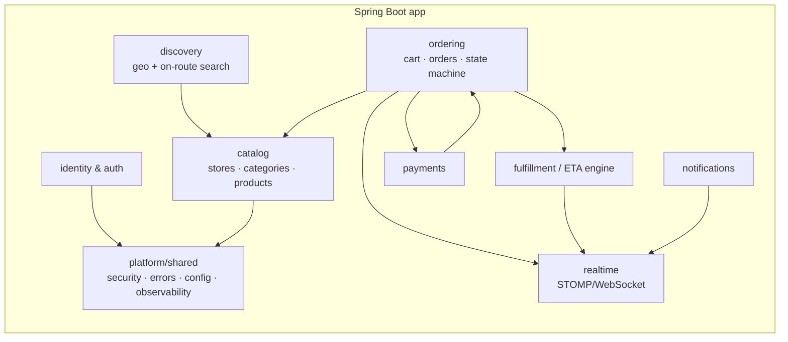
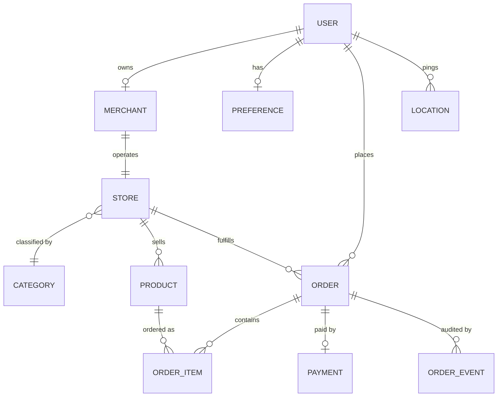
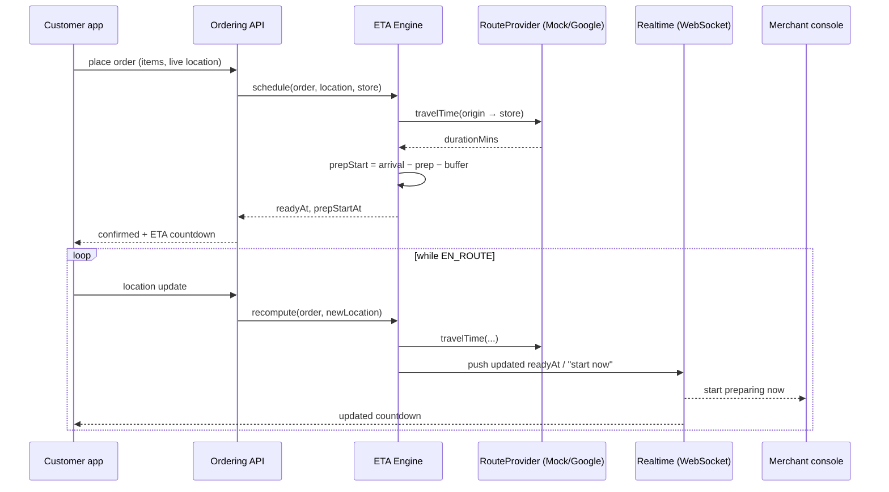
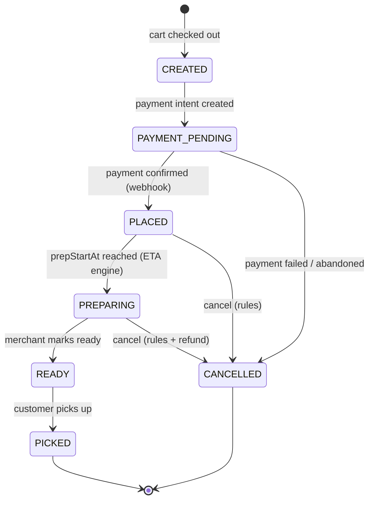
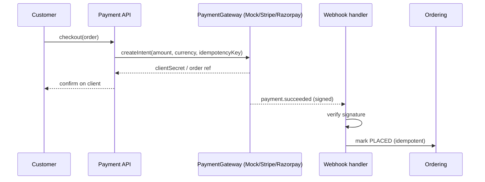
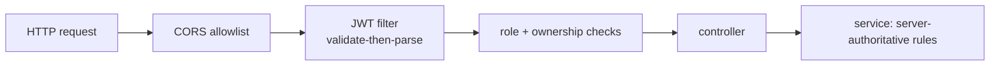
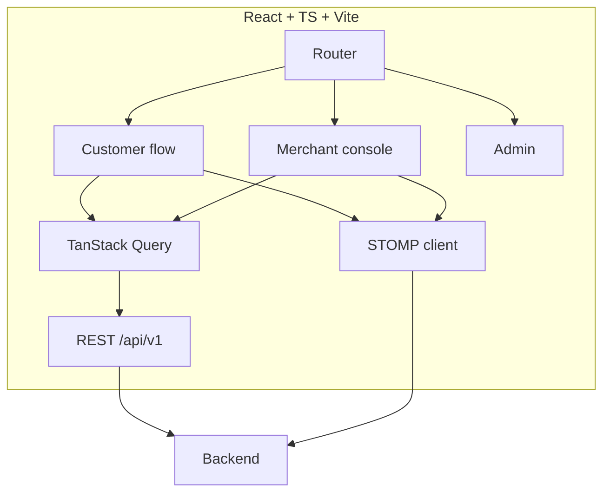
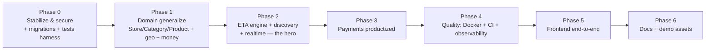

# OnTheWay — System Architecture

> **Status:** Finalized v1.0 (2026-06-16) · **Owner:** Manohar Eldhandi
> **Authored by:** Senior Developer + Senior Architect · **Reviewed by:** Senior Manager + Senior Director
> This document is the single source of truth for the end-to-end build. The ordered,
> assignable work breakdown derived from it lives in `to-do.md`.

---

## 1. Product vision (what we are actually building)

**OnTheWay** removes waiting. You pre-order from any nearby shop while you are *on the way*,
and the order is **ready exactly when you arrive** — synchronized to your live ETA. Walk in,
pick up, go. No queue, no idle wait, nothing prepared too early.

It is **not** food-only. The same primitive — *pre-order + ETA-synced pickup* — serves
restaurants, pharmacies (incl. prescriptions), grocery, retail, and many more verticals.

### The one thing that must be excellent
The **ETA-synchronization engine**. Everything else (catalog, cart, payments, auth) is table
stakes that many apps have. The hero is: *"the merchant starts preparing at the right moment so
your order is fresh and ready the second you reach the door."*

> **Director's framing:** "We invest the most engineering in the differentiator and use
> boring, proven technology everywhere else. A portfolio product is judged on *judgment* as much
> as code — over-engineering the commodity parts is a red flag, under-delivering the hero is fatal."

---

## 2. Architecture principles (agreed by all four roles)

1. **Modular monolith first, microservice-ready.** One deployable Spring Boot app with strict
   internal module boundaries. We do **not** prematurely distribute. (Manager: *"A solo
   portfolio product with 8 microservices signals poor judgment, not seniority."*)
2. **Provider abstractions for everything external.** Maps/routing and payments sit behind
   interfaces with a **mock implementation** so the entire product is **demoable with zero API
   keys**, and real providers drop in via config.
3. **Server-authoritative.** Prices, totals, ETAs, order status, and payment status are decided
   by the server, never trusted from the client.
4. **Secure by default.** Least-privilege roles, ownership checks on every resource, secrets out
   of source control, validated inputs.
5. **Everything is testable and migratable.** Versioned DB migrations; unit/slice/integration
   tests; reproducible via Docker.
6. **Extensible domain.** Model the generic "shop sells catalog items for ETA pickup" so adding a
   vertical is configuration/data, not a rewrite.

---

## 3. System context (C4 — Level 1)

```mermaid
graph TB
    subgraph Actors
      U[Customer]
      M[Merchant staff]
      A[Admin]
    end

    U -->|web app| FE[OnTheWay Web App<br/>React + TS + Vite]
    M -->|merchant console| FE
    A -->|admin console| FE

    FE -->|REST + WebSocket / JWT| BE[OnTheWay Backend<br/>Spring Boot modular monolith]

    BE --> DB[(MySQL)]
    BE --> RP{{Route/ETA Provider<br/>Mock | Google | Mapbox | OSRM}}
    BE --> PG{{Payment Gateway<br/>Mock | Stripe | Razorpay}}
    BE --> NО{{Notifications<br/>Mock | Email | SMS | Push}}
```

## 4. Container / module view (C4 — Level 2)



Module boundaries are enforced by package structure and (later) ArchUnit tests. Modules talk
through service interfaces, never by reaching into each other's repositories.

---

## 5. Domain model evolution

The current 8-entity model is a correct food-only v1. We generalize it for multi-vertical while
preserving the existing schema where possible (migrated via Flyway, never `ddl-auto`).



Key changes from v1:
- **`StoreType` enum → `CATEGORY` taxonomy** (data-driven; supports 100+ verticals).
- **`MenuItem` → `PRODUCT`** (generic catalog item; food is just one category). Backward-compatible
  table rename + columns; food semantics preserved.
- **Store geo**: `latitude`/`longitude` (+ open hours, prep defaults) on the store so discovery
  and ETA work.
- **Money**: `Double` → `BigDecimal` minor-units + `currency`.
- **`ORDER_EVENT`**: immutable audit of every status transition (who/when/why).
- **Prescription** (pharmacy vertical): attachment + review state on an order.

> **Architect's note:** We keep `User 1—1 Merchant` for now (simplest correct model for the demo).
> A future multi-store/franchise model (`Merchant 1—* Store`) is noted as a deliberate, deferred
> extension — documented, not built, to avoid speculative complexity.

---

## 6. The hero: ETA-synchronization engine

### 6.1 Responsibilities
- Estimate **travel time** from the customer's live location to the store.
- Know the store/product **prep time**.
- Compute the **prep-start moment** = `arrivalTime − prepTime − safetyBuffer`.
- Tell the merchant **when to start**, and keep **recalculating** as the customer moves.
- Produce a customer-facing **"ready at" / countdown**.

### 6.2 Design


- **`RouteProvider` interface** with:
  - `MockRouteProvider` — Haversine distance ÷ configurable average speed (keyless, deterministic,
    great for demos and tests).
  - `GoogleRouteProvider` / `MapboxRouteProvider` / `OsrmRouteProvider` — real traffic-aware
    routing, selected by config.
- **Scheduler**: a lightweight scheduled scan (or delay queue) flips orders to `PREPARING` at
  `prepStartAt` and emits the merchant "start now" event. Deterministic and testable.
- **Idempotent & clock-injected** so tests control time.

> **Manager's challenge / resolution:** "Don't gate the demo on Google billing." → The mock
> provider is the default; real providers are config-swappable. The *algorithm* (sync math) is
> ours and identical regardless of provider.

---

## 7. Order lifecycle (state machine)



- Transitions are guarded by a central validator; illegal transitions return `409`, never `500`.
- Every transition writes an `ORDER_EVENT` (actor, from, to, reason, timestamp).
- Cancellation rules and refund linkage are explicit (who can cancel, until which state).

---

## 8. Payments



- **`PaymentGateway` interface**: `MockGateway` (keyless demo, auto-confirms), `StripeGateway`,
  `RazorpayGateway` (SDKs already on the classpath).
- **Webhook-driven truth**: status changes only via verified webhooks; clients never set payment
  status.
- **Idempotency keys** on create + webhook dedup; **refunds** wired to cancellation.
- Money handled as `BigDecimal` minor units with currency throughout.

---

## 9. Real-time

- **STOMP over WebSocket** (the `spring-boot-starter-websocket` dependency is finally used).
- Channels: per-user order updates (`/topic/orders/{id}`), per-merchant inbound queue
  (`/topic/merchants/{id}/orders`), ETA/countdown stream.
- Authenticated handshake using the same JWT; authorization on subscription.
- Falls back gracefully to REST polling for clients that can't hold a socket.

---

## 10. Discovery & search

- `/api/v1/discovery`:
  - **Nearby**: stores within radius of a point (Haversine in SQL/JPA; pluggable to spatial index
    later).
  - **By category/vertical**, **open-now**, text search.
  - **On-route**: stores within a corridor of the customer's navigation polyline (uses
    `RouteProvider`).
- Results are paginated, filterable (veg/non-veg, price, availability), and personalized later via
  `Preference`.

---

## 11. Security architecture



- **AuthN**: short-lived **access JWT** + **refresh token** with rotation and revocation; logout.
- **AuthZ**: role rules (`USER/MERCHANT/ADMIN`) **plus** per-resource ownership checks (kills the
  current IDORs).
- **Registration**: role is **never** client-supplied; default `USER`; merchant/admin via
  controlled promotion.
- **Validation-first JWT**: verify signature/expiry before reading claims; map JWT errors to `401`.
- **Secrets**: env vars / external secret store; `.env.example` committed, real values never.
- **Hardening**: BCrypt (kept), CORS allowlist, auth rate-limiting/lockout, security headers,
  request-size limits, audit logging.

---

## 12. Cross-cutting / non-functional

| Concern | Decision |
|---|---|
| **Migrations** | **Flyway** versioned SQL. `ddl-auto` set to `validate`. |
| **Money** | `BigDecimal` minor units + ISO currency. |
| **API style** | Versioned `/api/v1`, consistent error envelope (reuse `ErrorResponse`), pagination on lists. |
| **Mapping** | Adopt **MapStruct** (dependency already present) to replace hand-written DTO builders. |
| **Config** | Spring profiles `dev` / `test` / `prod`; all secrets externalized. |
| **Observability** | Spring Boot Actuator (health/readiness), Micrometer metrics, structured JSON logs + correlation id. |
| **Testing** | JUnit 5 + Mockito (unit), `@WebMvcTest`/`@DataJpaTest` (slice), **Testcontainers** MySQL (integration). Coverage gate in CI. |
| **Packaging** | **Dockerfile** (multi-stage) + **docker-compose** (app + MySQL). |
| **CI/CD** | GitHub Actions: build → test → (image). |

---

## 13. Frontend architecture

- **React + TypeScript + Vite**, **TanStack Query** for server state, **React Router**, a map lib
  (MapLibre/Leaflet — keyless tiles for the demo), and a lightweight component system.
- **Three experiences** behind one app: **Customer** (discover → cart → checkout → live ETA),
  **Merchant console** (incoming orders, "start now" prompts, mark ready), **Admin**.
- **Real-time** via STOMP client; **the hero screen** is the map with route, store pin, and the
  ETA-sync countdown.
- Talks only to `/api/v1` + WebSocket; no business logic in the client.



---

## 14. Key technical decisions (ADR summary + review)

| # | Decision | Why | Review verdict |
|---|---|---|---|
| ADR-1 | **Modular monolith**, not microservices | Right-sized for scope; clean boundaries; fast to demo | Director: **approved** |
| ADR-2 | **Keep Java/Spring Boot** | Showcases existing strength; mature ecosystem | Manager: **approved** |
| ADR-3 | **Provider abstractions** (Maps, Payments, Notifications) with **mock defaults** | Keyless, reproducible demo; real impls swap via config | Director: **approved — this is the smart move** |
| ADR-4 | **Flyway** + `ddl-auto=validate` | Deterministic schema; no silent drift | Architect: **required** |
| ADR-5 | **Generalize** `StoreType→Category`, `MenuItem→Product` | Multi-vertical vision; avoid rewrite | Manager: **approved, do it early** |
| ADR-6 | **React + TS + Vite** frontend | End-to-end demoable; modern, common stack | Manager: **approved** |
| ADR-7 | **Testcontainers** integration tests | Real MySQL behavior; portfolio-grade rigor | Director: **approved** |
| ADR-8 | Defer multi-store/franchise, ML ranking, native mobile | Avoid speculative complexity | All: **approved (documented, not built)** |

---

## 15. Phased roadmap (sequencing the build)



1. **Phase 0 — Stabilize & secure.** Fix privesc, IDOR, JWT validation, secrets, dup-email,
   order-status state machine; add Flyway baseline; stand up the test harness.
2. **Phase 1 — Generalize the domain.** Store/Category/Product, store geo, `BigDecimal` money,
   `ORDER_EVENT` audit.
3. **Phase 2 — Make the value real.** ETA engine + `RouteProvider`, discovery (nearby/on-route),
   real-time tracking. **The differentiator.**
4. **Phase 3 — Payments.** Gateway abstraction, intents, webhooks, idempotency, refunds.
5. **Phase 4 — Prove it.** Docker + compose, CI, observability, pagination.
6. **Phase 5 — Show it.** React frontend across customer/merchant/admin with the map hero screen.
7. **Phase 6 — Document & demo.** Per-feature docs, seed data, demo script, README truthful.

> **Final director sign-off:** "Scope is realistic and correctly *sequenced by value and risk*:
> de-risk security, deliver the differentiator early, productize, then make it shine. Approved to
> proceed to the `to-do.md` breakdown and execution."
