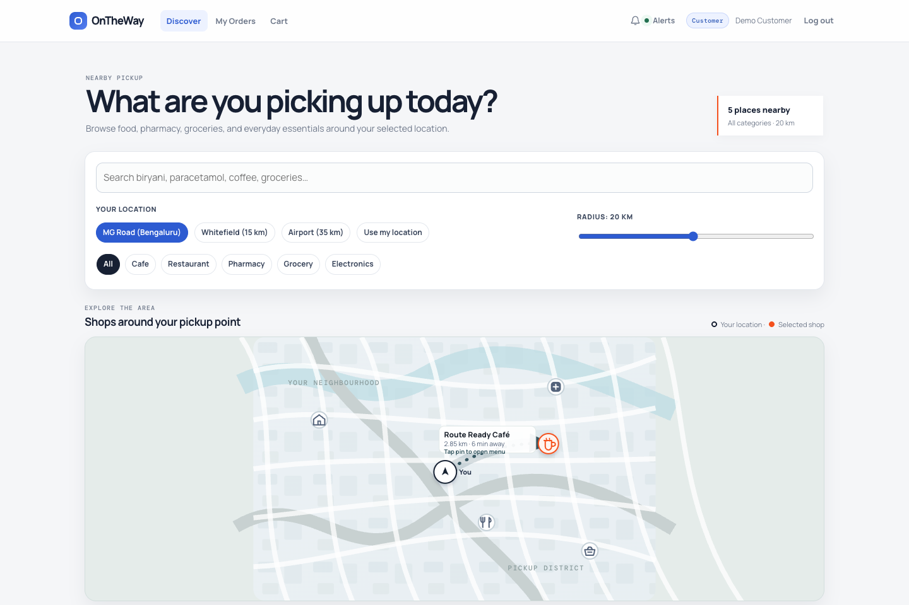
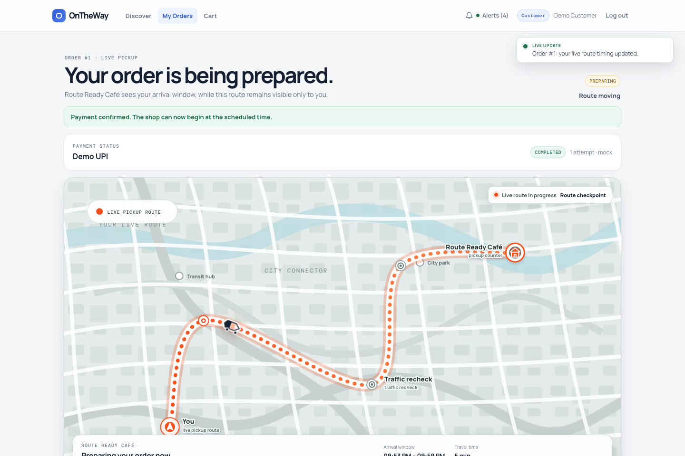
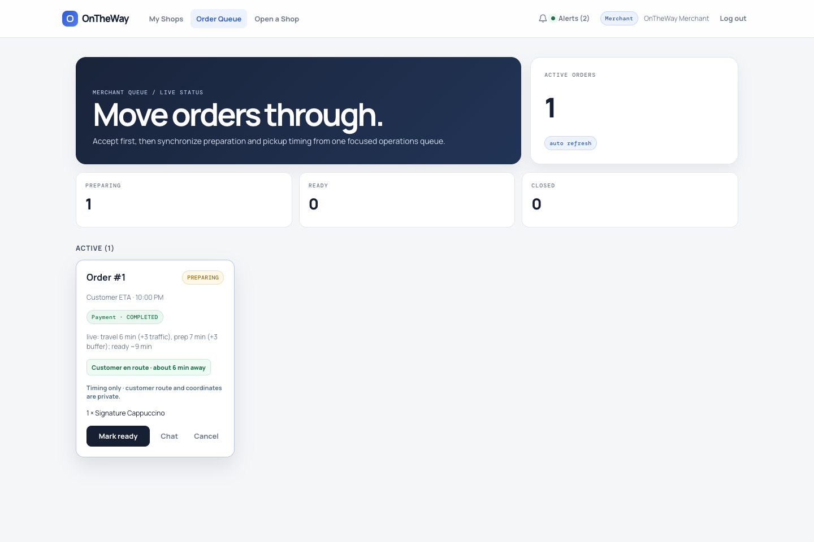

# OnTheWay

> Route-aware pickup for local commerce.

OnTheWay coordinates a customer's arrival with a shop's preparation time. Customers discover nearby storefronts, place an order, and follow a live pickup route. Merchants receive only the operational signals they need—payment state, preparation timing, and a customer arrival window—so orders are fresh when customers arrive, without exposing customer coordinates.

## Product preview

<p align="center">
  
</p>

<p align="center">
  
  
</p>

## What it does

### Customer experience

- Discover nearby cafés, restaurants, pharmacies, grocery stores, and electronics shops on an interactive map.
- Browse a shop menu from a map pin or storefront card, build a cart, and check out with a safe sandbox payment flow.
- See a transparent arrival window: route distance, estimated travel, traffic allowance, preparation time, and ready-by time.
- Follow a private, road-shaped live route after a merchant accepts the order. The vehicle motion is deliberately paced for a clear walkthrough.
- Exchange order-specific messages with the shop while the order is active.

### Merchant operations

- Manage multiple storefronts, menus, prices, availability, and shop applications.
- Accept paid orders and begin preparation in one action.
- Receive live operational cues: customer en route, approaching, and arrived at pickup—without access to a customer map or coordinates.
- Move orders through `PLACED → ACCEPTED → PREPARING → READY → PICKED` and verify the pickup code at hand-off.

### Platform foundations

- JWT authentication with role-based and ownership-aware authorization for customer, merchant, and administrator workflows.
- Spring Boot REST APIs, GraphQL catalog queries, WebSocket updates, Flyway migrations, and MySQL persistence.
- Payment gateway abstraction with sandbox, Stripe, and Razorpay adapters; idempotency, refunds, and signed webhook verification.
- Optional Kafka order events and Elasticsearch catalog search, with relational fallbacks for straightforward local development.

## How ETA synchronization works

```text
arrival       = current time + estimated travel time
prep duration = shop prep time + safety buffer
prep start    = arrival − prep duration
```

The ETA service recomputes the arrival window as route checkpoints arrive. The customer sees the live route; the merchant sees only timing, maintaining a clear privacy boundary.

## Quick start

### Run the complete application

Prerequisites: Java 17, Maven 3.9+, and Node.js 22.12+ (Node 24 LTS recommended).

```bash
# Starts backend and frontend with a fresh local dataset.
./scripts/start local

# Exposes the same application on your local network and prints the LAN URL.
./scripts/start network
```

The launcher installs frontend dependencies when needed, applies the real Flyway migrations to an in-memory local database, and stops both processes with `Ctrl-C`.

### Run with Docker and MySQL

```bash
docker compose up --build
```

| Service | Address |
| --- | --- |
| Web application | http://localhost:5173 |
| API and Swagger UI | http://localhost:8080/swagger-ui.html |
| Health check | http://localhost:8080/actuator/health |

## Development and verification

```bash
# Backend test suite
mvn -s custom-m2/settings.xml clean test

# Strict frontend type check and production build
cd frontend && npm ci && npm run build
```

See the [developer guide](docs/USAGE.md) for profiles, manual startup, configuration, and deployment details.

## Architecture

```text
React + TypeScript client
        │ REST / WebSocket / GraphQL
        ▼
Spring Boot application
 ├── authentication and role-aware API
 ├── discovery and catalog
 ├── orders, ETA, payments, and pickup state machine
 ├── realtime notifications and chat
 └── Flyway migrations
        │
        ├── MySQL (transactional source of truth)
        ├── Elasticsearch (optional catalog index)
        └── Kafka (optional order-event stream)
```

## Repository guide

| Path | Purpose |
| --- | --- |
| [`frontend/`](frontend/) | React, TypeScript, and Vite client |
| [`src/main/java/`](src/main/java/) | Spring Boot API, domain, security, ETA, payments, and realtime services |
| [`src/main/resources/db/migration/`](src/main/resources/db/migration/) | Versioned Flyway schema migrations |
| [`src/test/`](src/test/) | Unit, controller, integration, realtime, and persistence tests |
| [`docs/`](docs/) | Developer, architecture, performance, and feature documentation |
| [`k8s/`](k8s/) | Kubernetes manifests and deployment notes |
| [`scripts/start`](scripts/start) | One-command local or network startup |

## Further reading

- [Developer guide](docs/USAGE.md)
- [Architecture](ARCHITECTURE.md)
- [Stress testing](docs/STRESS_TESTING.md)
- [Kubernetes deployment](k8s/README.md)
- [ETA and discovery design](docs/phase-2-eta-and-discovery.md)
- [Payments design](docs/phase-3-payments.md)
- [Realtime and platform hardening](docs/phase-5-realtime-payments-hardening.md)

## License

Copyright (c) 2025 Manohar Eldhandi. All rights reserved. Provided "as is", without warranty of any kind.
